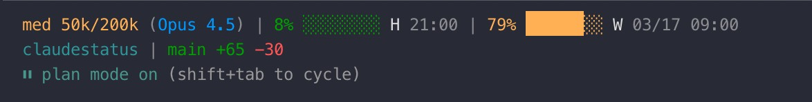

# Claude Code Status Line

A custom status line for [Claude Code](https://claude.com/claude-code) that displays the model, AI-generated session title, todo progress, session duration, token usage, rate limits, git state, the Claude Code version, an optional per-session label, and an optional multi-line memo. It runs as an external shell command, so it does not slow down Claude Code or consume any extra tokens.

## Screenshot



## What it shows

**Line 1 — Model & session**
| Segment | Description |
|---------|-------------|
| 🧠 | Shown only when extended thinking is enabled |
| **Model** | Current model name (e.g., Opus 4.7) |
| **AI Title** | Claude Code's auto-generated session title (truncated to 50 chars) |
| ✓ **Todo** | Completed / total todos for the current session, when any exist |
| **Duration** | Human-readable session duration (e.g., `8m 13s`, `2H 05m`) |

**Line 2 — Usage & limits**
| Segment | Description |
|---------|-------------|
| ⚡ | Shown only when `/fast` mode is active |
| **Effort** | Reasoning effort level (low / med / high) |
| **Tokens** | Used / total context window tokens |
| **H** | 5-hour rate limit: percentage, progress bar, reset time |
| **W** | Weekly (7-day) rate limit: percentage, progress bar, reset time |
| **E** | Extra usage: percentage, progress bar, credits spent / limit (if enabled) |

**Line 3 — Project, label & version**
| Segment | Description |
|---------|-------------|
| **Dir** | Current working directory name |
| **Branch** | Git branch name and file changes (+/-) |
| **Label** | Optional per-session label set via `/setmsg` (truncated to 60 chars) |
| **Version** | Claude Code version (e.g., `v2.1.143`) |

**Line 4+ — Multi-line memo (optional)**

Each line of the per-session memo (set via `/setmemo`) becomes its own dimmed row prefixed with `│`. Capped at 20 rows × 100 chars per line for sanity.

Usage percentages are color-coded: green (<50%) → yellow (≥50%) → orange (≥70%) → red (≥90%).

## Per-session label and memo

Two slash commands attach session-scoped text to the statusline:

```
/setmsg  refactoring auth flow                       ← short label after the git branch on line 3
/setmsg                                              ← clear the label

/setmemo TODO:\n- fix bug\n- update docs             ← cwd-scoped memo (default; survives /clear)
/setmemo                                             ← clear the cwd-scoped memo

/setmemo --session pinning this to the session       ← session-scoped memo (cleared when SID rotates)
/setmemo --session                                   ← clear the session-scoped memo
```

`/setmemo` accepts real multi-line input directly (paste with line breaks) **or** the literal escape sequence `\n` as a line-break separator. The script picks the right interpretation automatically.

Storage:
- Labels        → `~/.claude/cache/statusline-msg/<session_id>.txt`
- Memos (cwd)   → `~/.claude/cache/statusline-memo/cwd-<sha256[:16] of $PWD>.txt`
- Memos (session) → `~/.claude/cache/statusline-memo/session-<session_id>.txt`

The statusline reads the session-scoped file first and falls back to the cwd-scoped file, so a session memo wins when both exist. The cwd-scoped default means memos survive `/clear` (which rotates the session ID).

A SessionStart hook (`cleanup-statusline-msgs.py`) removes files older than 30 days from both directories — no manual cleanup needed.

## Requirements

### macOS / Linux
- `jq` — JSON parsing
- `python3` — for the SessionStart cleanup hook
- `curl` — for fetching usage data from the Anthropic API
- Claude Code with OAuth authentication (Pro/Max subscription)

### Windows
- PowerShell 5.1+ (included by default on Windows 10/11)
- `git` in PATH (for branch/diff info)
- Claude Code with OAuth authentication (Pro/Max subscription)

> `install.sh`, `/setmsg`, and `/setmemo` are bash-only. Windows users get the core statusline via `statusline.ps1`; the slash commands require a bash environment (WSL, Git Bash, etc.).

## Installation

### Quick install (macOS / Linux)

```bash
./install.sh
```

The installer is **idempotent** — re-run it any time to repair or update. It:
- Copies `statusline.sh` → `~/.claude/`
- Copies `cleanup-statusline-msgs.py` → `~/.claude/scripts/`
- Copies `scripts/setmsg.sh`, `scripts/setmemo.sh` → `~/.claude/scripts/`
- Copies `commands/setmsg.md`, `commands/setmemo.md` → `~/.claude/commands/`
- Adds `statusLine` to `~/.claude/settings.json` (only if unset)
- Registers the SessionStart cleanup hook (only if missing)

Override the install location with `CLAUDE_CONFIG_DIR=/custom/path ./install.sh`.

After installation, restart Claude Code (or open a new session).

### Manual setup — macOS / Linux

1. Copy the statusline script:

   ```bash
   cp statusline.sh ~/.claude/statusline.sh
   chmod +x ~/.claude/statusline.sh
   ```

2. Add to `~/.claude/settings.json`:

   ```json
   {
     "statusLine": {
       "type": "command",
       "command": "~/.claude/statusline.sh"
     }
   }
   ```

3. *(Optional, for `/setmsg` and `/setmemo`)* — install the scripts, commands, and cleanup hook:

   ```bash
   mkdir -p ~/.claude/scripts ~/.claude/commands \
            ~/.claude/cache/statusline-msg ~/.claude/cache/statusline-memo
   cp cleanup-statusline-msgs.py ~/.claude/scripts/
   cp scripts/setmsg.sh scripts/setmemo.sh ~/.claude/scripts/
   cp commands/setmsg.md commands/setmemo.md ~/.claude/commands/
   chmod +x ~/.claude/scripts/setmsg.sh ~/.claude/scripts/setmemo.sh
   ```

   Then merge this into `settings.json`:

   ```json
   {
     "hooks": {
       "SessionStart": [
         {
           "hooks": [
             {
               "type": "command",
               "command": "python3 \"$HOME/.claude/scripts/cleanup-statusline-msgs.py\""
             }
           ]
         }
       ]
     }
   }
   ```

4. Restart Claude Code to pick up the new slash commands.

### Manual setup — Windows

> **Windows users should use `statusline.ps1`** instead of the bash script.

1. Copy the script:

   ```powershell
   Copy-Item statusline.ps1 "$env:USERPROFILE\.claude\statusline.ps1"
   ```

2. Add to `%USERPROFILE%\.claude\settings.json`:

   **PowerShell / CMD:**
   ```json
   {
     "statusLine": {
       "type": "command",
       "command": "powershell -NoProfile -File \"%USERPROFILE%\\.claude\\statusline.ps1\""
     }
   }
   ```

   **Git Bash / WSL bash:**
   ```json
   {
     "statusLine": {
       "type": "command",
       "command": "powershell -NoProfile -File \"$USERPROFILE\\.claude\\statusline.ps1\""
     }
   }
   ```

   > Use `%USERPROFILE%` in CMD/PowerShell or `$USERPROFILE` in bash shells. The `%VAR%` syntax does not expand in bash.

3. Restart Claude Code.

## Caching

Usage data from the Anthropic API is cached for 60 seconds at `/tmp/claude/statusline-usage-cache.json` to avoid excessive API calls. The cache is shared across all Claude Code instances.

## License

MIT

## Author

Daniel Oliveira

[](https://danielapoliveira.com/)
[](https://x.com/daniel_not_nerd)
[](https://www.linkedin.com/in/daniel-ap-oliveira/)
